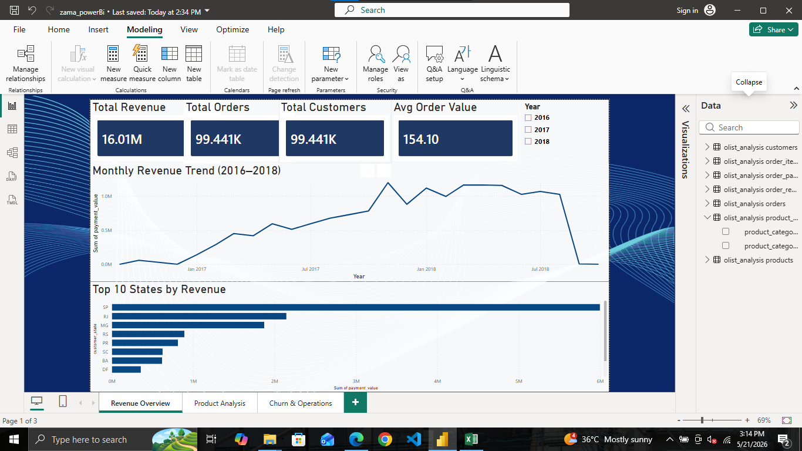
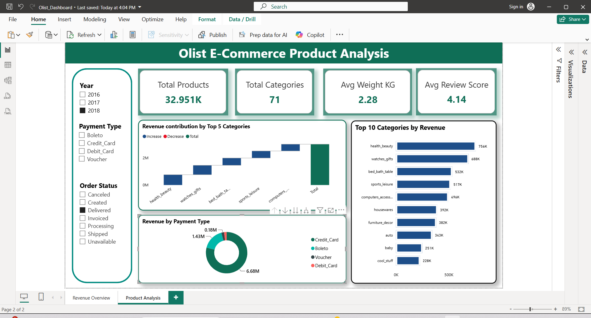
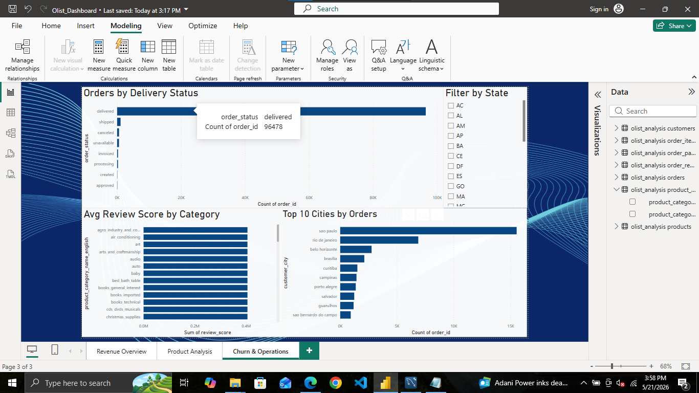

# 💰 Olist Financial Operations Analysis

## 📌 Problem Statement
Analyzed 100,000+ orders from a Brazilian e-commerce platform to identify 
revenue trends, customer churn patterns, delivery performance and 
profitability drivers across 2016-2018.

## 🛠️ Tools Used
- **MySQL** — Data modeling & querying (9 tables, 9 analytical queries)
- **Excel** — KPI summary, trend charts & business reporting
- **Power BI** — 3-page interactive dashboard with 12+ visuals

## 📁 Dataset
- Source: [Olist Brazilian E-Commerce Dataset - Kaggle](https://www.kaggle.com/datasets/olistbr/brazilian-ecommerce)
- Size: 100,000+ orders | 9 tables | 2016-2018

## 🔍 Key Business Insights
- Total revenue of **$16.01M** generated across 99,441 orders
- **97% of customers** never returned after first purchase — critical churn issue
- **São Paulo** dominates with 15K+ orders — largest market by far
- **Health & Beauty** is the top revenue category
- **78% of payments** made by credit card
- **92%+ orders** delivered on time

## 📸 Dashboard Preview

## 📂 Repository Structure
## 🚀 How to Run
1. Download dataset from Kaggle link above
2. Run `sql/analysis_queries.sql` in MySQL
3. Open `excel/Olist_Financial_Analysis.xlsx`
4. Recreate Power BI dashboard following `/powerbi/README.md`

## 👤 Author
**[Mohd Badruzama Ansari]** | Aspiring Data Analyst
